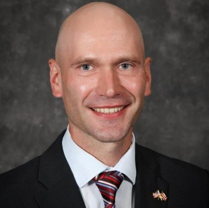

+++
title = "Team and Experts"
+++

### Our Team

Olevs Nikers, _**President**_  
Otto Tabuns, _**Director**_  
Andreis Purim, _**AI & Cybersecurity Junior Researcher**_  
Bobby Brooks, _**U.S. Strategy and Outreach Consultant**_  
Matthew Thomas, _**Editor**_  
Glen Grant, _**Senior Expert**_  
Sofiia Garmash, _**Assistant Country Manager: Ukraine**_

-----------

#### Olevs Nikers, President

Mr. Olevs Nikers is President of the Baltic Security Foundation and a senior analyst at the Jamestown Foundation, a Washington, D.C. based think tank. He has led the Baltic Security Strategy Project supported by the Baltic-American Freedom Foundation and the Jamestown Foundation (2017-2019) and currently he is Director of the Baltic Sea Security Initiative. From 2001 to 2019 Olevs has worked at the Ministry of Defense of Latvia. Among his other responsibilities, in a position 
of Chief Expert he has been responsible for preparing the Latvian military Contingent for International Peace keeping missions, as well as planning, coordinating and implementing International Development and Logistics projects for the International Security Assistance Force in Afghanistan.

Olevs holds a Master's degree in Political Science from University of Latvia (2001), as well as a Master's degree in International Relations from The Bush School of Government and Public Service, Texas, USA (2016). Currently he is studying at the Riga Stradins University's doctoral program in political science.

He is a member of Latvian Association of Political Scientists and the Association for Advancement of Baltic Studies.

-----------

#### Otto Tabuns, Director

Mr. Otto Tabuns is the founding director of the Baltic Security Foundation. He is the co-editor of two books (together with Mr. Olevs Nikers) and author of several publications on national and re- gional security, and is a lecturer of international security and policy debate at the Riga Graduate School of Law. Additionally, Otto is the permanent co-host of the Latvia Weekly broadcast in English on current affairs in his country.

Following his studies in diplomacy at the University of Latvia, and of international law at the Riga Graduate School of Law, Otto worked in the Latvian public service in the fields of strategic communications, defense planning, and crisis management for five years. He is a recipient of the Vītolu Foundation scholarship for international studies, and has been the first participant from Latvia in the MIRAI exchange program by the Ministry of Foreign Affairs of Japan. He has also participated in the SUSI foreign policy scholars program by the United States Department of State at the University of Delaware. 

Between 2017 and 2019, Otto was Executive Director of the Baltic Security Strategy Project, where 90 regional security experts the world over discussed and provided assessments and recom- mendations on shared military, societal and economic issues in Estonia, Latvia and Lithuania. Otto is a member of the Association for Advancement of Baltic Studies, International Studies Association, Japan Alumni Association of Latvia, and the Latvian Political Science Association. 

-----------

#### Matthew Thomas

Mr. Matthew Thomas is a Russia and post-Soviet area specialist. He works extensively with issues relating to hybrid warfare, intelligence, and diplomacy, and has served on projects dealing with NATO, Russia, and the Baltic States. He received his B.A. in International Studies and Modern Languages - Russian and his Master of International Affairs degrees from Texas A&M University. While at Texas A&M, he held numerous leadership positions in that institution’s Corps of Cadets, serving as Corps Scholastic Officer his senior year. He is a member of Dobro Slovo National Slavic Honor Society and a Glasscock Award recipient. He has previously served as a Project Assistant on the Baltic Security Strategy Project and has presented at Atlantic Council on the subject: How can NATO best respond to threats from a resurgent Russia over the next five years? 

With Baltic Security Foundation, Mr. Thomas serves as an expert contributor and as writer/ editor of the Foundation newsletters. Outside of work, he enjoys hockey, baseball, and college football, and is an avid reader of classic literature. He is a classical music buff, and can often be found playing the piano, clarinet, or singing. Mr. Thomas is a “dyed-in-the-wool” Texan and a direct descendent of the oldest signer of the Texas Declaration of Independence from Mexico, Collin McKinney. He is from Weatherford, Texas. 

-----------

#### Andreis Purim

Mr. Andreis Purim/Andrejs Puriņš is a Computer Engineer specializing in Cyber-defense. He graduated as an Electronic Technician at the Federal University of Technology - Paraná. There, he participated in numerous projects, including developing autonomous robots in partnership with the Advanced Laboratory of Robotics and Embedded Systems. He also became a Junior Researcher at the National Council for Scientific and Technological Development.

Andreis previously worked with Industrial Automation and Research and Development before enrolling at the University of Campinas (UNICAMP). At UNICAMP, he focuses two main areas: Cryptography and Data Science. He serves as a Liaison Officer for Baltic Security Foundation in Latin America, and contributes as an expert on Computer Science.

Andreis was born in Curitiba, from one of the first Latvian families to arrive in Brazil, and has long worked to preserve his Latvian heritage. He is the Head of the Media Department of the Brazilian Association of Latvian Culture and worked extensively with the Latvian Consulate and the Latvian Association of Latin America and the Caribbean.

-----------

#### Glen Grant

Mr. Glen Grant worked as a defence and reform expert in Ukraine working for the Ukrainian Institute for the Future. He is also a Senior Fellow in the UK Institute for Statecraft on their Building Integrity Initiative countering Russian influence. Glen graduated from the Royal Military Academy Sandhurst, the Junior Staff Course Warminster and the Joint Staff Defence College at the Royal Naval College Greenwich. His key work in the last twenty years has been delivering reform and change for defence and security organisations in Europe. He has worked in the Defence Ministries of Ukraine, Latvia, Estonia, Bulgaria, Macedonia, Montenegro, Moldova, Poland, Albania, Kosovo, Slovenia, Serbia and Chile.  As a business consultant he has worked with telecoms, agriculture, publishing and manufacturing. During his 37 year military career Glen commanded the UK Military Prison and an Artillery battery of 8 tracked guns. He worked on the operational and policy staffs in many different British and NATO Headquarters and MOD UK. This work involved him supporting many operations including both Gulf wars, Bosnia and Kosovo. He was Defence Attaché in Finland, Estonia and Latvia. In 2016 Glen was Project Manager in MOD Ukraine running a one year UK funded project “Reform of Defence Housing” and in January 2018 published a groundbreaking paper on reform of the Ukraine military in Kiev Post. He is a skilled change manager with a Masters degree in the Leadership of Innovation and Change from York St John University in UK.  Glen lives in Latvia and is a faculty member of Riga Business School lecturing on the Bachelor of Business Administration course in Strategy, HRM, Crisis Management and Entrepreneurship.

-----------

  

#### Sofiia Garmash

Ms. Sofiia Garmash currently is studying at the Riga Business School. From 2018 she interned at PSI CRO, Jones Lang LaSalle, TRK Engineerintg and Vivid Tech which involved a curial experience of teamwork and set-up of international standards.

Since 2019 Ms. Garmash has participated in student competitions such as Unilever Future Leaders’ League and L’Oréal Brandstorm. As part of the Riga Business School community, she contributed to the Student Union for the purpose of collective network and relations. Ms. Garmash has been a member of Debate Society since 2019 and participated in International Debate Competition in Latvian University. She has been honored to be recognized at the RBS Dean’s list of 2020.